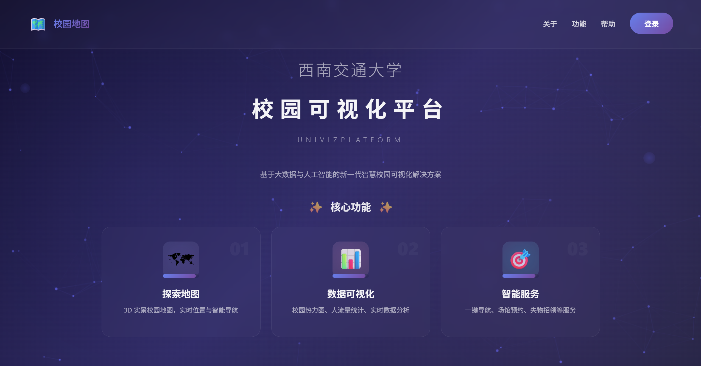
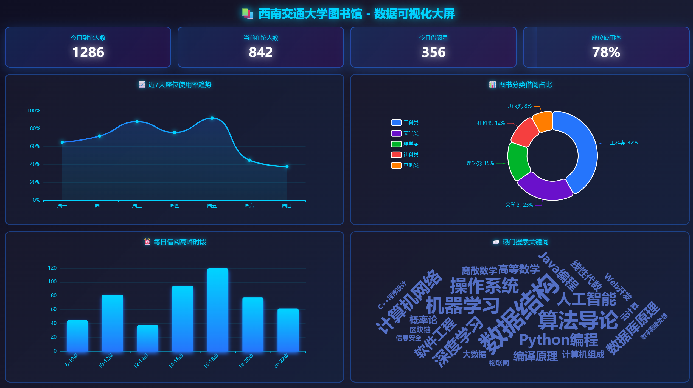

# 🗺️ 西南交通大学校园可视化平台

<div align="center">


**基于大数据与人工智能的新一代智慧校园可视化解决方案**

[在线演示](#) · [快速开始](#-快速开始) · [功能特性](#-功能特性) · [技术栈](#-技术栈)

</div>

---

## 📸 项目展示

### 🏠 首页展示

*粒子动画背景 + 逐字淡入效果的品牌展示页面*

### 🔐 登录页面

*玻璃态设计 + 动态渐变背景的高级登录界面*

### 🗺️ 地图主界面

*3D 校园地图 + 智能路线导航 + 实时定位*

### 📊 校园大数据可视化大屏

*实时数据监控 + 多维度统计分析 + 智能预警系统*

---

## ✨ 功能特性

### 🎨 用户界面

- **首页（Home）**
  - 粒子背景动画系统（100+ 粒子实时连线）
  - 西南交通大学品牌展示（逐字动画效果）
  - 三大核心功能卡片（探索地图、数据可视化、智能服务）
  - 响应式导航栏与路由守卫

- **登录页（Login）**
  - 玻璃态毛玻璃设计（Glassmorphism）
  - 动态渐变背景（6 个浮动圆圈动画）
  - 品牌标识分层展示（Logo + 大学名称 + 平台标题）
  - 表单输入聚焦动画与验证
  - 社交登录入口（微信/QQ/GitHub）

### 🗺️ 地图核心功能（MapView）

- **3D/2D 地图切换**：支持平面与立体视图自由切换
- **实时定位**：获取用户当前位置并在地图上标注
- **智能搜索**：支持校园建筑、POI 点位搜索
- **路线导航**：提供步行/驾车两种导航模式
- **场地预约**：集成场地预约与信息查询
- **路由守卫**：未登录用户自动跳转至登录页

### 🏛️ 校园场馆系统

#### 📚 图书馆模块

- 开放时间、借阅规则、座位预约
- 自习室预约（新增）：支持按日期、时间段、人数选择房间；冲突检测与本地保存；可取消预约
- 近 7 天座位使用率趋势图
- 图书分类借阅占比统计
- 借阅高峰时段分析
- 热门搜索关键词云

#### 🍽️ 食堂模块

- 营业时间、就餐规则、餐厅设施
- 餐桌使用率实时监控
- 菜品分类销售占比
- 就餐高峰时段统计
- 热门菜品关键词云

#### 🏟️ 体育馆模块

- 场地开放时间、使用规则
- 场地使用率趋势分析
- 运动项目参与占比
- 运动高峰时段统计
- 热门运动项目词云

### 📊 校园大数据可视化

#### 🎯 数据大屏系统

- **实时数据监控**
  - 今日到馆人数、当前在馆人数实时统计
  - 今日借阅量、座位使用率动态更新
  - 大屏标题：西南交通大学图书馆 - 数据可视化大屏

- **多维度数据分析**
  - 📈 **近7天座位使用率趋势**：折线图展示一周内的使用率变化
  - 🥧 **图书分类借阅占比**：环形饼图显示 T 科技类、文学类、理学类、社科类、其他类的占比分布
  - 📊 **每日借阅高峰时段**：柱状图呈现 8-10点、10-12点、12-14点等时段的借阅量对比
  - ☁️ **热门搜索关键词云**：词云图展示高频检索词（操作系统、机器学习、Python编程、人工智能、数据结构等）

- **可视化特性**
  - 深蓝色科技风格主题
  - 实时数据刷新动画
  - 响应式布局适配
  - ECharts 交互式图表
  - 独立窗口全屏展示

#### 📈 场馆数据统计

- **ECharts 图表库**：折线图、饼图、柱状图、词云图
- **全屏大屏模式**：支持独立窗口展示完整数据看板
- **实时数据更新**：模拟真实场景的动态数据展示
- **多场馆支持**：图书馆、食堂、体育馆数据独立统计

## 🛠️ 技术栈

### 核心技术

- **前端框架**：Vue 3.5.22 (Composition API)
- **构建工具**：Vite 7.1.11
- **路由管理**：Vue Router 4.6.3
- **地图服务**：百度地图 GL API
- **数据可视化**：Apache ECharts 5.6.0
- **词云插件**：echarts-wordcloud 2.1.0
- **样式方案**：原生 CSS (Scoped) + CSS Animations

### 设计特色

- **Glassmorphism（玻璃态）**：毛玻璃效果 + 半透明背景
- **粒子系统**：Canvas 实现的动态粒子连线动画
- **渐变动画**：多层渐变背景的无缝切换
- **微交互**：表单聚焦、按钮悬停、卡片翻转等细节动效

## 📦 环境配置

### 前置要求

- **Node.js**：>= 16.0.0（推荐 18.x 或 20.x LTS 版本）
- **npm**：>= 8.0.0 或 **pnpm**：>= 8.0.0
- **浏览器**：Chrome 90+、Edge 90+、Firefox 88+、Safari 14+

### 依赖版本

```json
{
  "vue": "^3.5.22",
  "vue-router": "^4.6.3",
  "vite": "^7.1.11",
  "echarts": "^5.6.0",
  "echarts-wordcloud": "^2.1.0"
}
```

## 🚀 快速开始

### 1. 克隆项目

```bash
git clone <repository-url>
cd campus-map-vue3
```

### 2. 安装依赖

使用 npm：

```bash
npm install
```

或使用 pnpm（推荐，更快）：

```bash
pnpm install
```

### 3. 配置百度地图 API

#### 3.1 复制环境变量模板

```bash
cp .env.example .env
```

或在 Windows PowerShell 中：

```powershell
Copy-Item .env.example .env
```

#### 3.2 配置你的百度地图 AK

在 `.env` 文件中填入你的百度地图 AK：

```env
VITE_BAIDU_MAP_AK=你的百度地图AK
```

> 💡 **获取百度地图 AK**：
>
> 1. 访问 [百度地图开放平台](https://lbsyun.baidu.com/)
> 2. 注册/登录账号
> 3. 进入"控制台" → "应用管理" → "我的应用"
> 4. 点击"创建应用"，选择"浏览器端"类型
> 5. 复制生成的 AK 密钥并粘贴到 `.env` 文件中

> ⚠️ **重要提示**：
>
> - `.env` 文件包含敏感信息，已被 `.gitignore` 忽略，不会提交到 Git
> - 请勿将你的 AK 密钥分享给他人或提交到公开仓库
> - 如果 AK 泄露，请立即在百度地图控制台重新生成

### 4. 启动开发服务器

```bash
npm run dev
```

或使用 pnpm：

```bash
pnpm dev
```

访问：http://localhost:5173

### 5. 构建生产版本

```bash
npm run build
```

构建产物将生成在 `dist/` 目录下。

### 6. 预览生产构建

```bash
npm run preview
```

## 📂 项目结构

```
campus-map-vue3/
├── public/                      # 静态资源
│   ├── p1.png                  # 当前位置图标
│   ├── 图书馆.jpg               # 图书馆标记
│   ├── gym.png                 # 体育馆标记
│   └── canteen.png             # 食堂标记
├── src/
│   ├── router/
│   │   └── index.js            # 路由配置（Home/Login/Map + 守卫）
│   ├── styles/
│   │   └── animations.css      # 全局动画库（20+ 关键帧动画）
│   ├── data/
│   │   └── places.json         # 地点坐标与图标的统一配置
│   ├── components/             # 公共组件
│   │   ├── Map.vue            # 地图主组件（已迁移至 MapView）
│   │   ├── Sidebar.vue        # 侧边栏搜索组件
│   │   └── Topbar.vue         # 顶部导航栏
│   ├── views/                 # 页面视图
│   │   ├── Home.vue           # 🏠 首页（粒子动画 + 品牌展示）
│   │   ├── Login.vue          # 🔐 登录页（玻璃态设计）
│   │   ├── MapView.vue        # 🗺️ 地图主界面
│   │   ├── LibraryModal.vue   # 图书馆信息弹窗
│   │   ├── GymModal.vue       # 体育馆信息弹窗
│   │   └── CanteenModal.vue   # 食堂信息弹窗
│   ├── App.vue                # 根组件（router-view + 过渡动画）
│   └── main.js                # 入口文件（Vue Router + 全局样式）
├── docs/
│   └── images/                # 文档图片资源
│       ├── home.png
│       ├── login.png
│       ├── map.png
│       └── dashboard.png
├── .env.example               # 环境变量模板
├── index.html                 # HTML 模板
├── vite.config.js             # Vite 配置
├── package.json               # 项目依赖
├── README.md                  # 项目说明（本文件）
├── QUICKSTART.md              # 快速入门指南
└── ROUTER.md                  # 路由系统文档
```

## 🎨 核心组件说明

### 页面组件

#### 🏠 Home.vue（首页）

**特色功能：**
- Canvas 粒子系统（100 个粒子 + 实时连线）
- 西南交通大学逐字淡入动画
- 三大功能卡片（悬停翻转效果）
- 响应式导航栏（毛玻璃效果）

**技术亮点：**
```javascript
// 粒子类实现
class Particle {
    constructor(canvas) {
        this.x = Math.random() * canvas.width
        this.y = Math.random() * canvas.height
        this.vx = (Math.random() - 0.5) * 0.5
        this.vy = (Math.random() - 0.5) * 0.5
    }
}
```

#### 🔐 Login.vue（登录页）

**特色功能：**
- 玻璃态卡片设计（backdrop-filter: blur）
- 6 个浮动圆圈动画
- 品牌标识分层展示（Logo 脉冲 + 文字淡入）
- 表单输入下划线动画
- 社交登录按钮（微信/QQ/GitHub）

**设计规范：**
- 西南交通大学（1.6rem，字间距 0.15em）
- 校园可视化平台（1.2rem，字间距 0.2em）
- CAMPUS VISUALIZATION PLATFORM（0.75rem，大写）

#### 🗺️ MapView.vue（地图主界面）

**核心功能：**
- 百度地图初始化（3D/2D 模式）
- POI 标记点管理
- 路线规划与导航
- 用户定位与交互

**路由守卫：**
```javascript
router.beforeEach((to, from, next) => {
    if (to.path === '/map') {
        const isLoggedIn = localStorage.getItem('isLoggedIn')
        if (!isLoggedIn) {
            next('/login?redirect=/map')
        } else {
            next()
        }
    } else {
        next()
    }
})
```

### 数据配置

#### src/data/places.json

统一维护各地点的地理坐标与图标：

```json
[
  {
    "id": "library",
    "name": "西南交通大学图书馆",
    "label": "📚 图书馆",
    "coords": { "lng": 103.99198021119682, "lat": 30.772101164459176 },
    "icon": "/图书馆.jpg"
  }
]
```

### 场馆信息弹窗

#### LibraryModal.vue / GymModal.vue / CanteenModal.vue

- 基本信息展示
- 使用规则说明
- ECharts 数据可视化（折线图/饼图/柱状图/词云）
- 全屏大屏模式

## 🔧 配置说明

### Vite 配置 (vite.config.js)

```javascript
export default defineConfig({
  plugins: [vue()],
  server: {
    port: 5173, // 开发服务器端口
    open: true, // 自动打开浏览器
    host: "0.0.0.0", // 允许局域网访问
  },
  build: {
    outDir: "dist", // 构建输出目录
    assetsDir: "assets",
    sourcemap: false, // 生产环境不生成 sourcemap
  },
});
```

### Vue Router 配置 (src/router/index.js)

```javascript
import { createRouter, createWebHistory } from 'vue-router'
import Home from '../views/Home.vue'
import Login from '../views/Login.vue'
import MapView from '../views/MapView.vue'

const routes = [
  { path: '/', name: 'Home', component: Home, meta: { transition: 'fade' } },
  { path: '/login', name: 'Login', component: Login, meta: { transition: 'slide' } },
  { path: '/map', name: 'Map', component: MapView, meta: { requiresAuth: true, transition: 'zoom' } }
]

const router = createRouter({
  history: createWebHistory(),
  routes
})

// 路由守卫
router.beforeEach((to, from, next) => {
  if (to.meta.requiresAuth) {
    const isLoggedIn = localStorage.getItem('isLoggedIn')
    if (!isLoggedIn) {
      next({ path: '/login', query: { redirect: to.fullPath } })
    } else {
      next()
    }
  } else {
    next()
  }
})

export default router
```

### ECharts 全局注册 (main.js)

```javascript
import { createApp } from 'vue'
import App from './App.vue'
import router from './router'
import * as echarts from 'echarts'
import 'echarts-wordcloud'
import './styles/animations.css'

const app = createApp(App)
app.use(router)
app.config.globalProperties.$echarts = echarts
app.mount('#app')
```

## 📊 数据可视化说明

### 大屏展示系统

#### 数据指标卡片

顶部展示 4 个核心实时数据：

| 指标           | 说明           | 示例值  |
| -------------- | -------------- | ------- |
| 📍 今日到馆人数 | 累计到馆人次   | 1286 人 |
| 👥 当前在馆人数 | 实时在馆人数   | 842 人  |
| 📚 今日借阅     | 当日借阅总量   | 356 本  |
| 💺 座位使用率   | 当前座位占用率 | 78%     |

#### 图表类型

- **📈 折线图**：趋势分析（近7天座位使用率变化）
- **🥧 环形饼图**：占比统计（图书分类借阅分布）
- **📊 柱状图**：时段对比（每日高峰时段分析）
- **☁️ 词云图**：热度展示（热门关键词频率）

#### 设计特色

- **深蓝科技风格**：渐变蓝色背景 + 发光边框
- **实时数据流**：数字滚动动画 + 图表动态更新
- **网格布局**：2x2 图表网格 + 顶部数据卡片
- **响应式设计**：自适应不同屏幕尺寸

### 全屏大屏模式

点击场馆弹窗中的"查看完整大屏"按钮，系统会在新窗口中打开独立的数据可视化看板：

**功能特性：**
- 🖥️ 全屏沉浸式展示
- 📊 4 个核心数据指标卡片
- 📈 4 个交互式 ECharts 图表（2x2 网格）
- 🔄 实时数据自动更新
- 📱 响应式布局适配

**技术实现：**
```javascript
// 打开独立大屏窗口
const openFullDashboard = () => {
    const width = 1920
    const height = 1080
    window.open(
        '/dashboard',
        'Dashboard',
        `width=${width},height=${height},left=0,top=0`
    )
}
```

## 🌐 浏览器兼容性

| 浏览器  | 版本要求 | 说明                     |
| ------- | -------- | ------------------------ |
| Chrome  | >= 90    | ✅ 完全支持               |
| Edge    | >= 90    | ✅ 完全支持               |
| Firefox | >= 88    | ✅ 完全支持               |
| Safari  | >= 14    | ⚠️ 部分 3D 效果可能有差异 |
| IE      | ❌        | 不支持                   |

## 🐛 常见问题

### 1. 地图无法显示

**原因：**
- 百度地图 AK 未配置或配置错误
- 网络连接问题
- 跨域错误

**解决方案：**
```bash
# 1. 检查 .env 文件
cat .env
# 应该看到：VITE_BAIDU_MAP_AK=你的AK

# 2. 重启开发服务器
npm run dev

# 3. 查看控制台错误
按 F12 → Console 标签页
```

### 2. 页面跳转到登录页但应该在首页

**原因：** 路由守卫拦截了未登录用户

**解决方案：**
```javascript
// 清除登录状态（如需重新测试）
localStorage.removeItem('isLoggedIn')
localStorage.removeItem('username')
```

### 3. 粒子动画卡顿

**原因：** 粒子数量过多或设备性能不足

**解决方案：**
```javascript
// src/views/Home.vue - 减少粒子数量
for (let i = 0; i < 50; i++) {  // 原来是 100
    particles.push(new Particle(canvas))
}
```

### 4. 动画不播放

**原因：** CSS 动画库未加载

**解决方案：**
```javascript
// 检查 main.js 是否导入
import './styles/animations.css'
```

### 5. 图表不显示

**原因：** ECharts 未正确注册

**解决方案：**
```bash
# 1. 重新安装依赖
npm install echarts echarts-wordcloud

# 2. 检查 main.js
import * as echarts from 'echarts'
import 'echarts-wordcloud'
app.config.globalProperties.$echarts = echarts
```

## 📝 开发指南

### 路由系统使用

#### 添加新页面

1. 在 `src/views/` 下创建新组件
2. 在 `src/router/index.js` 中添加路由
3. 配置路由守卫（如需鉴权）

```javascript
// 示例：添加"关于"页面
const routes = [
  // ...existing routes
  {
    path: '/about',
    name: 'About',
    component: () => import('../views/About.vue'),
    meta: { transition: 'fade' }
  }
]
```

#### 导航方法

```javascript
// 1. 使用 router-link（推荐）
<router-link to="/login">登录</router-link>

// 2. 编程式导航
import { useRouter } from 'vue-router'
const router = useRouter()
router.push('/map')

// 3. 带参数导航
router.push({ path: '/login', query: { redirect: '/map' } })
```

### 动画定制

#### 修改粒子效果

```javascript
// src/views/Home.vue
class Particle {
    constructor(canvas) {
        // 调整粒子速度
        this.vx = (Math.random() - 0.5) * 1.0  // 增大速度
        
        // 调整粒子大小
        this.radius = Math.random() * 3 + 2    // 增大尺寸
        
        // 调整透明度
        this.opacity = Math.random() * 0.8 + 0.5  // 更明显
    }
}
```

#### 添加新动画

```css
/* src/styles/animations.css */
@keyframes customAnimation {
    0% { transform: scale(1); }
    50% { transform: scale(1.1); }
    100% { transform: scale(1); }
}

.my-element {
    animation: customAnimation 2s ease-in-out infinite;
}
```

### 性能优化

#### 图表优化

```javascript
// 使用 v-show 而非 v-if
<div v-show="chartVisible">
    <div ref="chartRef"></div>
</div>

// 图表实例复用
let chartInstance = null
const initChart = () => {
    if (!chartInstance) {
        chartInstance = this.$echarts.init(this.$refs.chartRef)
    }
    chartInstance.setOption(option)
}
```

#### 粒子系统优化

```javascript
// 使用 requestIdleCallback 降低优先级
const animate = () => {
    requestIdleCallback(() => {
        // 动画逻辑
        requestAnimationFrame(animate)
    })
}
```

### 代码规范

- **组件命名**：PascalCase（`HomeView.vue`）
- **事件命名**：kebab-case（`@user-login`）
- **CSS 类名**：kebab-case + BEM（`login-card__header--active`）
- **变量命名**：camelCase（`isLoggedIn`）

### 调试技巧

```javascript
// 1. 查看路由信息
import { useRoute } from 'vue-router'
const route = useRoute()
console.log('当前路由:', route.path)
console.log('路由参数:', route.query)

// 2. 查看地图实例
console.log('地图实例:', map)
console.log('所有标记:', allMarkers)

// 3. 查看图表实例
console.log('图表实例:', this.$echarts.getInstanceByDom(this.$refs.chartRef))

// 4. 性能监控
console.time('粒子渲染')
// ... 动画代码
console.timeEnd('粒子渲染')
```

## 🎯 路线图

### 已完成 ✅

- [x] Vue 3 + Vite 项目搭建
- [x] Vue Router 路由系统
- [x] 首页粒子动画效果
- [x] 登录页玻璃态设计
- [x] 地图主界面集成
- [x] 路由守卫与权限控制
- [x] 三大场馆信息模块（图书馆、食堂、体育馆）
- [x] ECharts 数据可视化
- [x] 校园大数据可视化大屏系统
- [x] 实时数据监控与统计分析
- [x] 响应式布局适配

### 开发中 🚧

- [ ] 用户个人中心
- [ ] 实时通知系统
- [ ] 更多场馆数据接入
- [ ] 移动端原生应用

### 计划中 📋

- [ ] 微信小程序版本
- [ ] 后端 API 对接
- [ ] 用户行为分析
- [ ] AI 智能推荐
- [ ] 多语言支持（中/英）

## 🤝 贡献指南

感谢你考虑为西南交通大学校园可视化平台做出贡献！

### 贡献类型

- 🐛 **Bug 修复**：发现并修复项目中的问题
- ✨ **新功能**：添加新的特性或改进现有功能
- 📝 **文档**：改进或补充项目文档
- 🎨 **UI/UX**：优化界面设计或用户体验
- ⚡ **性能**：提升代码性能或优化资源加载

### 贡献流程

1. **Fork 项目**
   ```bash
   # 点击 GitHub 页面右上角的 Fork 按钮
   ```

2. **克隆仓库**
   ```bash
   git clone https://github.com/YOUR_USERNAME/campus-map-vue3.git
   cd campus-map-vue3
   ```

3. **创建分支**
   ```bash
   git checkout -b feature/amazing-feature
   # 或
   git checkout -b fix/bug-description
   ```

4. **开发与测试**
   ```bash
   npm install
   npm run dev
   # 进行开发...
   npm run build  # 确保构建成功
   ```

5. **提交代码**
   ```bash
   git add .
   git commit -m "feat: 添加某某功能"
   # 或
   git commit -m "fix: 修复某某问题"
   ```

   **提交信息规范：**
   - `feat:` 新功能
   - `fix:` 修复 Bug
   - `docs:` 文档更新
   - `style:` 代码格式调整
   - `refactor:` 代码重构
   - `perf:` 性能优化
   - `test:` 测试相关
   - `chore:` 构建/工具链相关

6. **推送分支**
   ```bash
   git push origin feature/amazing-feature
   ```

7. **创建 Pull Request**
   - 访问你的 Fork 仓库页面
   - 点击 "New Pull Request"
   - 填写 PR 标题和描述
   - 等待审核

### 代码审查

所有 PR 需要经过以下检查：
- ✅ 代码风格符合项目规范
- ✅ 功能正常运行且无明显 Bug
- ✅ 新增功能有对应文档说明
- ✅ 构建成功且无警告

## 📄 开源协议

本项目采用 [MIT License](LICENSE) 开源协议。

你可以自由地：
- ✅ 商业使用
- ✅ 修改代码
- ✅ 分发
- ✅ 私人使用

但需要：
- 📝 保留版权声明
- 📝 保留许可证副本

## 📮 联系方式

如有问题或建议，欢迎通过以下方式联系：

- 💬 **Issues**：[GitHub Issues](https://github.com/maile456/campus-map-vue3/issues)
- 📧 **Email**：your-email@example.com
- 🐛 **Bug 报告**：[提交 Bug](https://github.com/maile456/campus-map-vue3/issues/new?template=bug_report.md)
- ✨ **功能请求**：[提交建议](https://github.com/maile456/campus-map-vue3/issues/new?template=feature_request.md)

## 📚 相关文档

- [快速入门指南](QUICKSTART.md) - 5 分钟快速上手
- [路由系统文档](ROUTER.md) - 详细的路由配置说明
- [百度地图 API 文档](https://lbsyun.baidu.com/index.php?title=jspopularGL) - 官方地图 API
- [ECharts 文档](https://echarts.apache.org/zh/index.html) - 数据可视化库
- [Vue 3 官方文档](https://cn.vuejs.org/) - Vue 3 框架文档

## 🏆 致谢

感谢以下开源项目和服务：

- [Vue.js](https://vuejs.org/) - 渐进式 JavaScript 框架
- [Vite](https://vitejs.dev/) - 下一代前端构建工具
- [百度地图开放平台](https://lbsyun.baidu.com/) - 地图服务支持
- [Apache ECharts](https://echarts.apache.org/) - 强大的数据可视化库
- [echarts-wordcloud](https://github.com/ecomfe/echarts-wordcloud) - 词云图插件

---

<div align="center">

**🎓 西南交通大学校园可视化平台**

基于大数据与人工智能的新一代智慧校园可视化解决方案

Made with ❤️ by Southwest Jiaotong University

**⭐ 如果这个项目对你有帮助，请给个 Star 支持一下！**

[](https://github.com/maile456/campus-map-vue3)
[](https://github.com/maile456/campus-map-vue3/fork)

</div>
